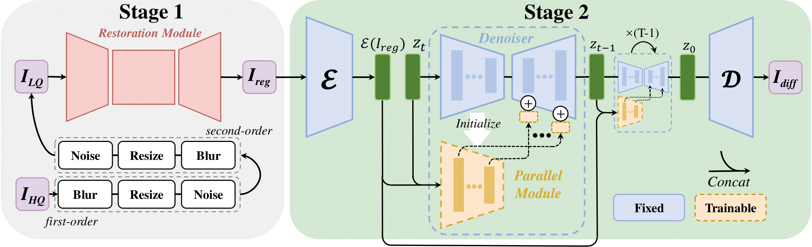
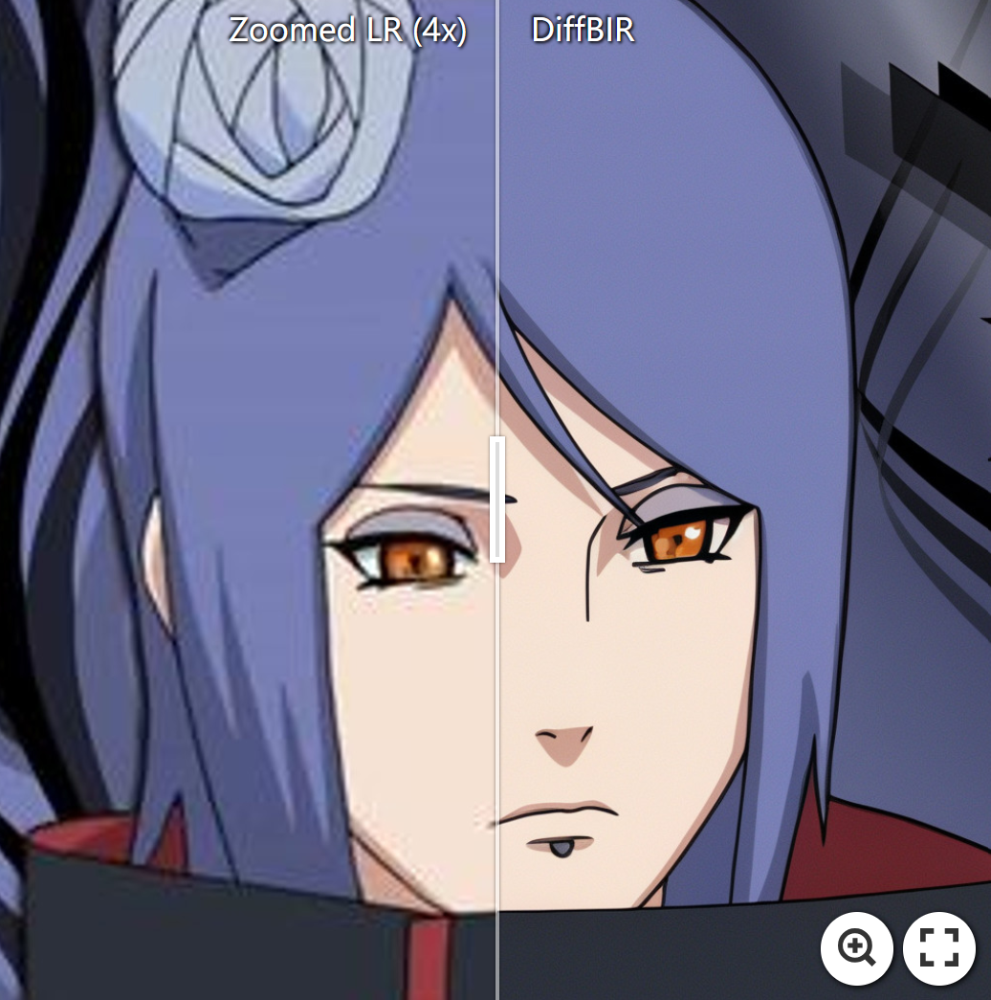
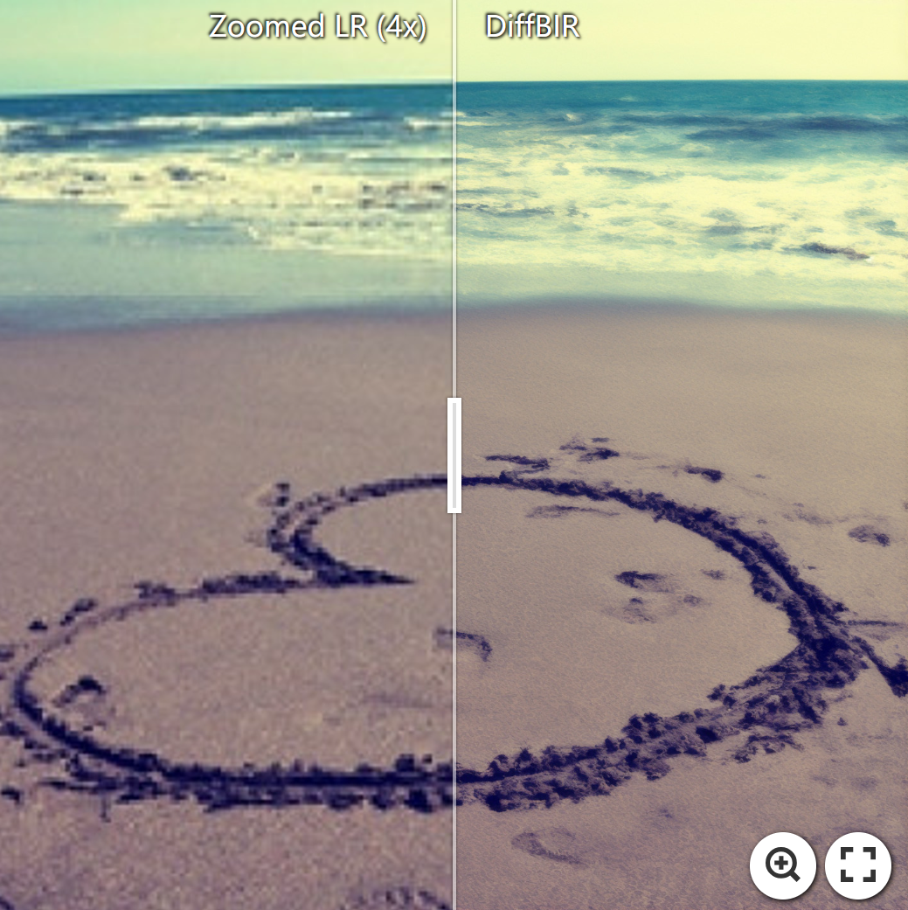
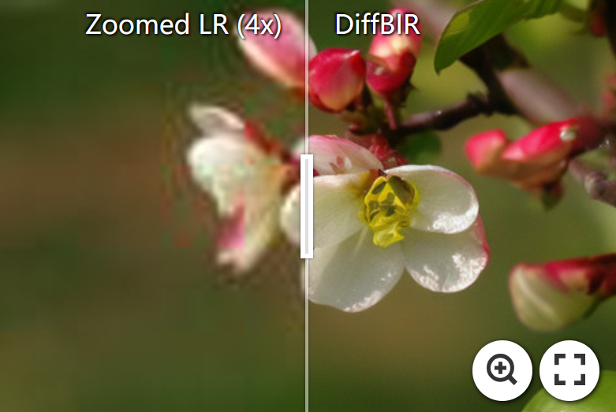
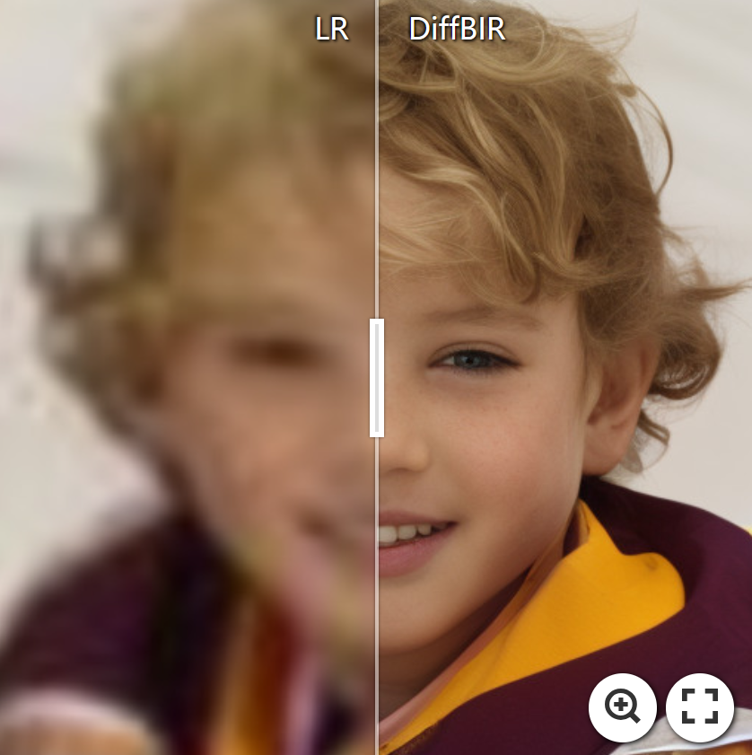
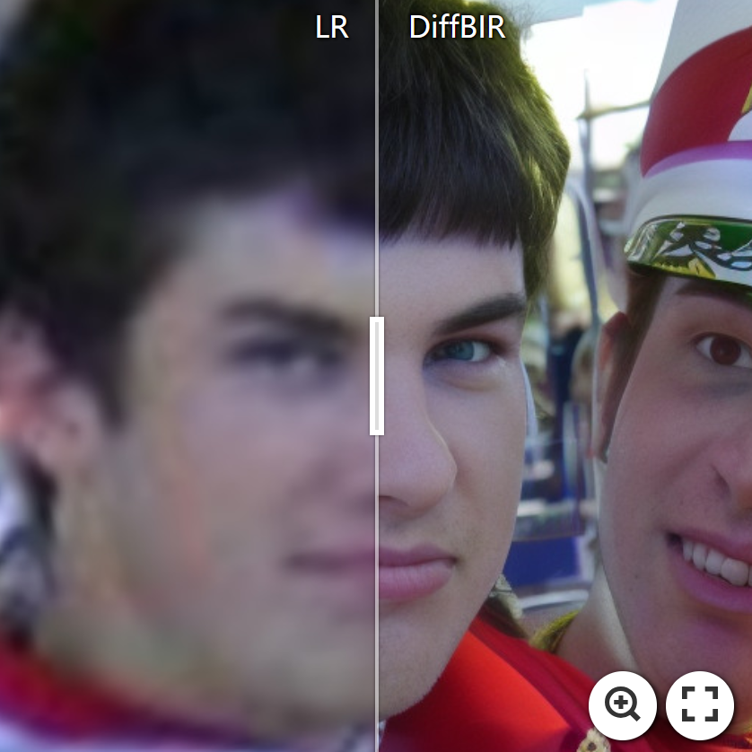
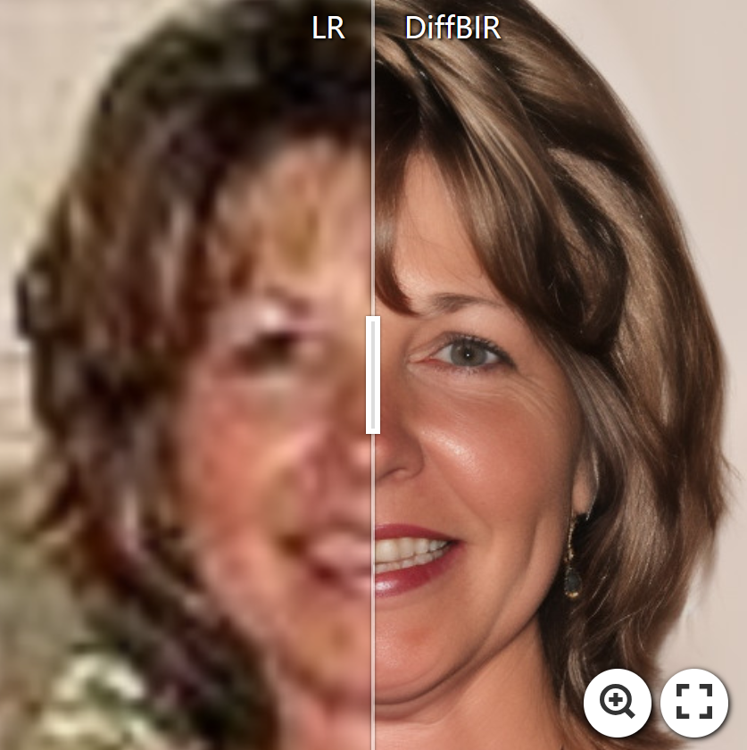
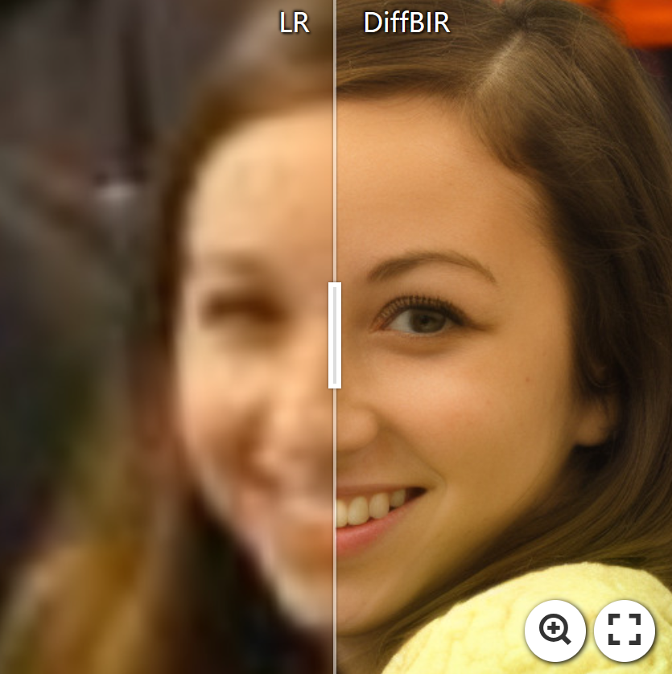
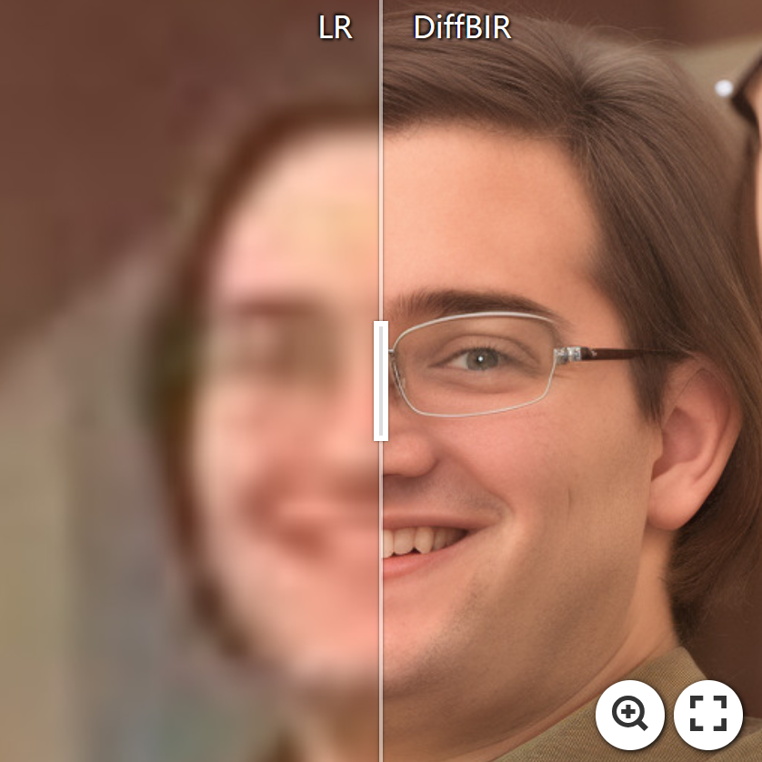

<p align="center">
    
</p>

## DiffBIR: Towards Blind Image Restoration with Generative Diffusion Prior

[Paper](https://arxiv.org/abs/2308.15070) | [Project Page](https://0x3f3f3f3fun.github.io/projects/diffbir/)

 [](https://colab.research.google.com/github/camenduru/DiffBIR-colab/blob/main/DiffBIR_colab.ipynb)

[Xinqi Lin](https://0x3f3f3f3fun.github.io/)<sup>1,\*</sup>, [Jingwen He](https://github.com/hejingwenhejingwen)<sup>2,\*</sup>, [Ziyan Chen](https://orcid.org/0000-0001-6277-5635)<sup>2</sup>, [Zhaoyang Lyu](https://scholar.google.com.tw/citations?user=gkXFhbwAAAAJ&hl=en)<sup>2</sup>, [Ben Fei](https://scholar.google.com/citations?user=skQROj8AAAAJ&hl=zh-CN&oi=ao)<sup>2</sup>, [Bo Dai](http://daibo.info/)<sup>2</sup>, [Wanli Ouyang](https://wlouyang.github.io/)<sup>2</sup>, [Yu Qiao](http://mmlab.siat.ac.cn/yuqiao)<sup>2</sup>, [Chao Dong](http://xpixel.group/2010/01/20/chaodong.html)<sup>1,2</sup>

<sup>1</sup>Shenzhen Institute of Advanced Technology, Chinese Academy of Sciences<br><sup>2</sup>Shanghai AI Laboratory

<p align="center">
    
</p>

:star:If DiffBIR is helpful for you, please help star this repo. Thanks!:hugs:

## :book:Table Of Contents

- [Visual Results On Real-world Images](#visual_results)
- [Installation](#installation)
- [Pretrained Models](#pretrained_models)
- [Quick Start (gradio demo)](#quick_start)
- [Inference](#inference)
- [Train](#train)
- [Update](#update)
- [TODO](#todo)

## <a name="visual_results"></a>:eyes:Visual Results On Real-world Images

<!-- <details close>
<summary>General Image Restoration</summary> -->
### General Image Restoration

[](https://imgsli.com/MTk5ODI3) [](https://imgsli.com/MTk5ODI4) [](https://imgsli.com/MTk5ODI1)

[](https://imgsli.com/MTk5ODIy) [](https://imgsli.com/MTk5ODIz)

[](https://imgsli.com/MTk5ODI0) [](https://imgsli.com/MjAxMjM0)

<!-- </details> -->

<!-- <details close> -->
<!-- <summary>Face Image Restoration</summary> -->
### Face Image Restoration

[](https://imgsli.com/MTk5ODI5) [](https://imgsli.com/MTk5ODMw) [](https://imgsli.com/MTk5ODMy)

[](https://imgsli.com/MTk5ODM0) [](https://imgsli.com/MTk5ODM1) [](https://imgsli.com/MTk5ODM2)

[](https://imgsli.com/MjA0MzQw)

<!-- </details> -->

## <a name="installation"></a>:gear:Installation
- **Python** >= 3.9
- **CUDA** >= 11.3
- **PyTorch** >= 1.12.1
- **xformers** == 0.0.16

```shell
# clone this repo
git clone https://github.com/XPixelGroup/DiffBIR.git
cd DiffBIR

# create a conda environment with python >= 3.9
conda create -n diffbir python=3.9
conda activate diffbir

conda install pytorch==1.12.1 torchvision==0.13.1 cudatoolkit=11.3 -c pytorch
conda install xformers==0.0.16 -c xformers

# other dependencies
pip install -r requirements.txt
```

## <a name="pretrained_models"></a>:dna:Pretrained Models

| Model Name | Description | HuggingFace | BaiduNetdisk |
| :--------- | :---------- | :---------- | :---------- |
| general_swinir_v1.ckpt | Stage1 model (SwinIR) for general image restoration. | [download](https://huggingface.co/lxq007/DiffBIR/resolve/main/general_swinir_v1.ckpt) | [download](https://pan.baidu.com/s/1uvSvJgcoL_Knj0h22-9TvA?pwd=v3v6) (pwd: v3v6) |
| general_full_v1.ckpt | Full model for general image restoration. "Full" means it contains both the stage1 and stage2 model. | [download](https://huggingface.co/lxq007/DiffBIR/resolve/main/general_full_v1.ckpt) | [download](https://pan.baidu.com/s/1gLvW1nvkJStdVAKROqaYaA?pwd=86zi) (pwd: 86zi) |
| face_swinir_v1.ckpt | Stage1 model (SwinIR) for face restoration. | [download](https://huggingface.co/lxq007/DiffBIR/resolve/main/face_swinir_v1.ckpt) | [download](https://pan.baidu.com/s/1cnBBC8437BJiM3q6suaK8g?pwd=xk5u) (pwd: xk5u) |
| face_full_v1.ckpt | Full model for face restoration. | [download](https://huggingface.co/lxq007/DiffBIR/resolve/main/face_full_v1.ckpt) | [download](https://pan.baidu.com/s/1pc04xvQybkynRfzK5Y8K0Q?pwd=ov8i) (pwd: ov8i) |

## <a name="quick_start"></a>:flight_departure:Quick Start

Download [general_full_v1.ckpt](https://huggingface.co/lxq007/DiffBIR/resolve/main/general_full_v1.ckpt) and [general_swinir_v1.ckpt](https://huggingface.co/lxq007/DiffBIR/resolve/main/general_swinir_v1.ckpt) to `weights/`, then run the following command to interact with the gradio website.

```
python gradio_diffbir.py \
--ckpt weights/general_full_v1.ckpt \
--config configs/model/cldm.yaml \
--reload_swinir \
--swinir_ckpt weights/general_swinir_v1.ckpt \
--device cuda
```

<div align="center">
    <kbd></img></kbd>
</div>

## <a name="inference"></a>:crossed_swords:Inference

### Full Pipeline (Remove Degradations & Refine Details)

#### General Image

Download [general_full_v1.ckpt](https://huggingface.co/lxq007/DiffBIR/resolve/main/general_full_v1.ckpt) and [general_swinir_v1.ckpt](https://huggingface.co/lxq007/DiffBIR/resolve/main/general_swinir_v1.ckpt) to `weights/` and run the following command.

```shell
python inference.py \
--input inputs/general \
--config configs/model/cldm.yaml \
--ckpt weights/general_full_v1.ckpt \
--reload_swinir --swinir_ckpt weights/general_swinir_v1.ckpt \
--steps 50 \
--sr_scale 4 \
--image_size 512 \
--color_fix_type wavelet --resize_back \
--output results/general \
--device cuda
```

If you are confused about where the `reload_swinir` option came from, please refer to the [degradation details](#degradation-details).

#### Face Image
Download [face_full_v1.ckpt](https://huggingface.co/lxq007/DiffBIR/resolve/main/face_full_v1.ckpt) to `weights/` and run the following command.

```shell
# for aligned face inputs
python inference_face.py \
--config configs/model/cldm.yaml \
--ckpt weights/face_full_v1.ckpt \
--input inputs/face/aligned \
--steps 50 \
--sr_scale 1 \
--image_size 512 \
--color_fix_type wavelet \
--output results/face/aligned --resize_back \
--has_aligned \
--device cuda

# for unaligned face inputs
python inference_face.py \
--config configs/model/cldm.yaml \
--ckpt weights/face_full_v1.ckpt \
--input inputs/face/whole_img \
--steps 50 \
--sr_scale 1 \
--image_size 512 \
--color_fix_type wavelet \
--output results/face/whole_img --resize_back \
--device cuda
```

### Only Stage1 Model (Remove Degradations)

Download [general_swinir_v1.ckpt](https://huggingface.co/lxq007/DiffBIR/resolve/main/general_swinir_v1.ckpt), [face_swinir_v1.ckpt](https://huggingface.co/lxq007/DiffBIR/resolve/main/face_swinir_v1.ckpt) for general, face image respectively, and run the following command.

```shell
python scripts/inference_stage1.py \
--config configs/model/swinir.yaml \
--ckpt [swinir_ckpt_path] \
--input [lq_dir] \
--sr_scale 1 --image_size 512 \
--output [output_dir_path]
```

### Only Stage2 Model (Refine Details)

Since the proposed two-stage pipeline is very flexible, you can utilize other awesome models to remove degradations instead of SwinIR and then leverage the Stable Diffusion to refine details.

```shell
# step1: Use other models to remove degradations and save results in [img_dir_path].

# step2: Refine details of step1 outputs.
python inference.py \
--config configs/model/cldm.yaml \
--ckpt [full_ckpt_path] \
--steps 50 --sr_scale 1 --image_size 512 \
--input [img_dir_path] \
--color_fix_type wavelet --resize_back \
--output [output_dir_path] \
--disable_preprocess_model \
--device cuda
```

##  <a name="train"></a>:stars:Train

### Degradation Details

For general image restoration, we first train both the stage1 and stage2 model under codeformer degradation to enhance the generative capacity of the stage2 model. In order to improve the ability for degradation removal, we train another stage1 model under Real-ESRGAN degradation and utilize it during inference.

For face image restoration, we adopt the degradation model used in [DifFace](https://github.com/zsyOAOA/DifFace/blob/master/configs/training/swinir_ffhq512.yaml) for training and directly utilize the SwinIR model released by them as our stage1 model.

### Data Preparation

1. Generate file list of training set and validation set.

    ```shell
    python scripts/make_file_list.py \
    --img_folder [hq_dir_path] \
    --val_size [validation_set_size] \
    --save_folder [save_dir_path] \
    --follow_links
    ```
    
    This script will collect all image files in `img_folder` and split them into training set and validation set automatically. You will get two file lists in `save_folder`, each line in a file list contains an absolute path of an image file:
    
    ```
    save_folder
    ├── train.list # training file list
    └── val.list   # validation file list
    ```

2. Configure training set and validation set.

    For general image restoration, fill in the following configuration files with appropriate values.

    - [training set](configs/dataset/general_deg_codeformer_train.yaml) and [validation set](configs/dataset/general_deg_codeformer_val.yaml) for **CodeFormer** degradation.
    - [training set](configs/dataset/general_deg_realesrgan_train.yaml) and [validation set](configs/dataset/general_deg_realesrgan_val.yaml) for **Real-ESRGAN** degradation.

    For face image restoration, fill in the face [training set](configs/dataset/face_train.yaml) and [validation set](configs/dataset/face_val.yaml) configuration files with appropriate values.

### Train Stage1 Model

1. Configure training-related information.

    Fill in the configuration file of [training](configs/train_swinir.yaml) with appropriate values.

2. Start training.

    ```shell
    python train.py --config [training_config_path]
    ```

    :bulb::Checkpoints of SwinIR will be used in training stage2 model.

### Train Stage2 Model

1. Download pretrained [Stable Diffusion v2.1](https://huggingface.co/stabilityai/stable-diffusion-2-1-base) to provide generative capabilities.

    ```shell
    wget https://huggingface.co/stabilityai/stable-diffusion-2-1-base/resolve/main/v2-1_512-ema-pruned.ckpt --no-check-certificate
    ```

2. Create the initial model weights.

    ```shell
    python scripts/make_stage2_init_weight.py \
    --cldm_config configs/model/cldm.yaml \
    --sd_weight [sd_v2.1_ckpt_path] \
    --swinir_weight [swinir_ckpt_path] \
    --output [init_weight_output_path]
    ```

    You will see some [outputs](assets/init_weight_outputs.txt) which show the weight initialization.

3. Configure training-related information.

    Fill in the configuration file of [training](configs/train_cldm.yaml) with appropriate values.

4. Start training.

    ```shell
    python train.py --config [training_config_path]
    ```

##  <a name="update"></a>:new:Update

- **2023.08.30**: Repo is released.
- **2023.09.06**: Update [colab demo](https://colab.research.google.com/github/camenduru/DiffBIR-colab/blob/main/DiffBIR_colab.ipynb). Thanks to [camenduru](https://github.com/camenduru)!:hugs:
- **2023.09.08**: Add support for restoring unaligned faces.

##  <a name="todo"></a>:climbing:TODO

- [x] Release code and pretrained models:computer:.
- [x] Update links to paper and project page:link:.
- [ ] Release real47 testset:minidisc:.
- [ ] Reduce the memory usage of DiffBIR:smiley_cat:.
- [ ] Provide HuggingFace demo:notebook:.
- [ ] Upload inference code of latent image guidance:page_facing_up:.
- [ ] Improve the performance:superhero:.
- [ ] Add a patch-based sampling schedule:mag:.

## Citation

Please cite us if our work is useful for your research.

```
@article{2023diffbir,
  author    = {Xinqi Lin, Jingwen He, Ziyan Chen, Zhaoyang Lyu, Ben Fei, Bo Dai, Wanli Ouyang, Yu Qiao, Chao Dong},
  title     = {DiffBIR: Towards Blind Image Restoration with Generative Diffusion Prior},
  journal   = {arxiv},
  year      = {2023},
}
```

## License

This project is released under the [Apache 2.0 license](LICENSE).

## Acknowledgement

This project is based on [ControlNet](https://github.com/lllyasviel/ControlNet) and [BasicSR](https://github.com/XPixelGroup/BasicSR). Thanks for their awesome work.

## Contact

If you have any questions, please feel free to contact with me at linxinqi@tju.edu.cn.
