<p align="center">
    
</p>

## DiffBIR: Towards Blind Image Restoration with Generative Diffusion Prior

[Paper](https://arxiv.org/abs/2308.15070) | [Project Page](https://0x3f3f3f3fun.github.io/projects/diffbir/)

 [](https://openxlab.org.cn/apps/detail/linxinqi/DiffBIR-official) [](https://colab.research.google.com/github/camenduru/DiffBIR-colab/blob/main/DiffBIR_colab.ipynb)

[Xinqi Lin](https://0x3f3f3f3fun.github.io/)<sup>1,\*</sup>, [Jingwen He](https://github.com/hejingwenhejingwen)<sup>2,3,\*</sup>, [Ziyan Chen](https://orcid.org/0000-0001-6277-5635)<sup>1</sup>, [Zhaoyang Lyu](https://scholar.google.com.tw/citations?user=gkXFhbwAAAAJ&hl=en)<sup>2</sup>, [Bo Dai](http://daibo.info/)<sup>2</sup>, [Fanghua Yu](https://github.com/Fanghua-Yu)<sup>1</sup>, [Wanli Ouyang](https://wlouyang.github.io/)<sup>2</sup>, [Yu Qiao](http://mmlab.siat.ac.cn/yuqiao)<sup>2</sup>, [Chao Dong](http://xpixel.group/2010/01/20/chaodong.html)<sup>1,2</sup>

<sup>1</sup>Shenzhen Institute of Advanced Technology, Chinese Academy of Sciences<br><sup>2</sup>Shanghai AI Laboratory<br><sup>3</sup>The Chinese University of Hong Kong

<p align="center">
    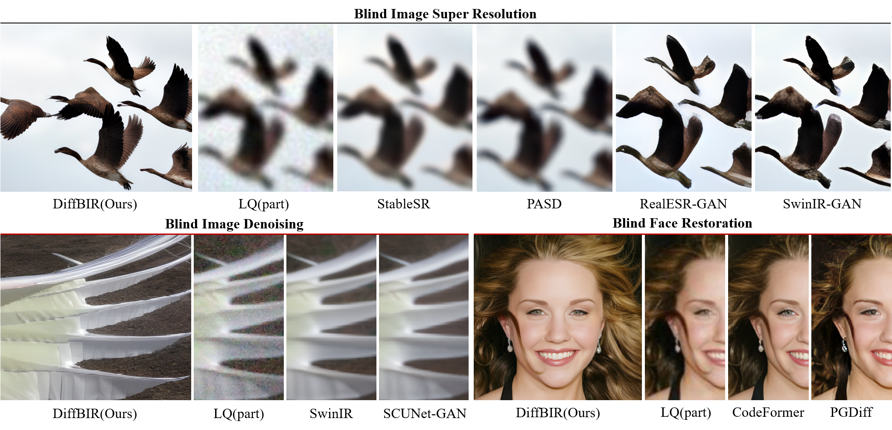
</p>

---

<p align="center">
    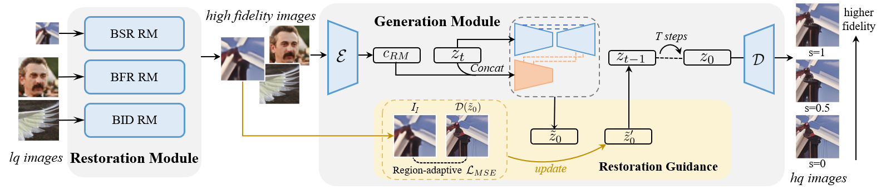
</p>

:star:If DiffBIR is helpful for you, please help star this repo. Thanks!:hugs:

## :book:Table Of Contents

- [Update](#update)
- [Visual Results On Real-world Images](#visual_results)
- [TODO](#todo)
- [Installation](#installation)
- [Pretrained Models](#pretrained_models)
- [Inference](#inference)
- [Train](#train)

## <a name="update"></a>:new:Update

- **2024.04.08**: ✅ Release everything about our [updated manuscript](https://arxiv.org/abs/2308.15070), including (1) a **new model** trained on subset of laion2b-en and (2) a **more readable code base**, etc. DiffBIR is now a general restoration pipeline that could handle different blind image restoration tasks with a unified generation module.
- **2023.09.19**: ✅ Add support for Apple Silicon! Check [installation_xOS.md](assets/docs/installation_xOS.md) to work with **CPU/CUDA/MPS** device!
- **2023.09.14**: ✅ Integrate a patch-based sampling strategy ([mixture-of-diffusers](https://github.com/albarji/mixture-of-diffusers)). [**Try it!**](#patch-based-sampling) Here is an [example](https://imgsli.com/MjA2MDA1) with a resolution of 2396 x 1596. GPU memory usage will continue to be optimized in the future and we are looking forward to your pull requests!
- **2023.09.14**: ✅ Add support for background upsampler (DiffBIR/[RealESRGAN](https://github.com/xinntao/Real-ESRGAN)) in face enhancement! :rocket: [**Try it!**](#inference_fr)
- **2023.09.13**: :rocket: Provide online demo (DiffBIR-official) in [OpenXLab](https://openxlab.org.cn/apps/detail/linxinqi/DiffBIR-official), which integrates both general model and face model. Please have a try! [camenduru](https://github.com/camenduru) also implements an online demo, thanks for his work.:hugs:
- **2023.09.12**: ✅ Upload inference code of latent image guidance and release [real47](inputs/real47) testset.
- **2023.09.08**: ✅ Add support for restoring unaligned faces.
- **2023.09.06**: :rocket: Update [colab demo](https://colab.research.google.com/github/camenduru/DiffBIR-colab/blob/main/DiffBIR_colab.ipynb). Thanks to [camenduru](https://github.com/camenduru)!:hugs:
- **2023.08.30**: This repo is released.

## <a name="visual_results"></a>:eyes:Visual Results On Real-world Images

### Blind Image Super-Resolution

[](https://imgsli.com/MTk5ODI3) [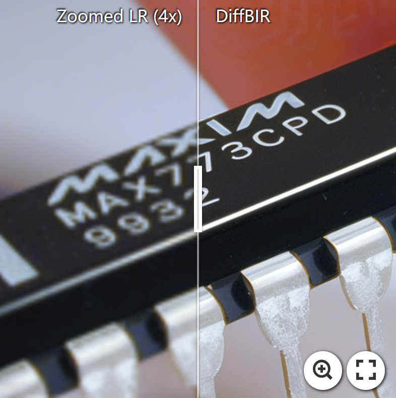](https://imgsli.com/MTk5ODI4) [](https://imgsli.com/MTk5ODI1)

<!-- [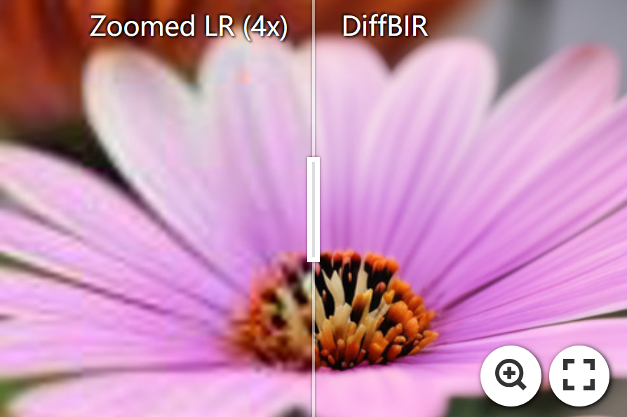](https://imgsli.com/MTk5ODIy) [](https://imgsli.com/MTk5ODIz)

[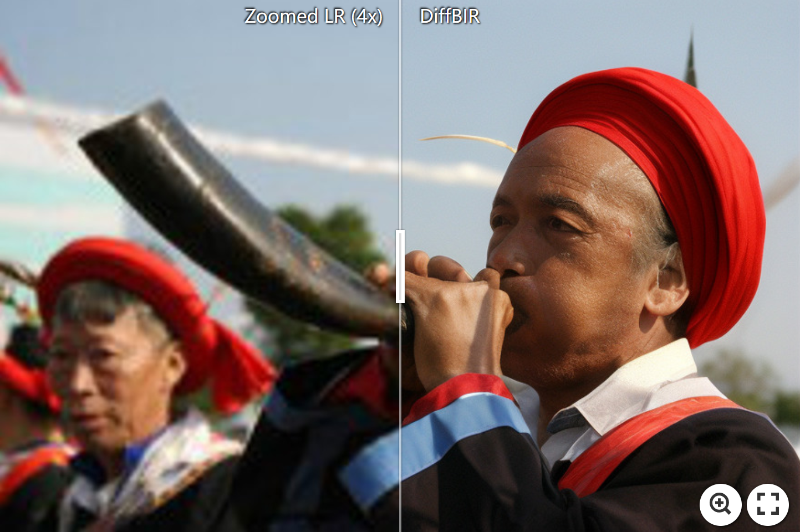](https://imgsli.com/MTk5ODI0) [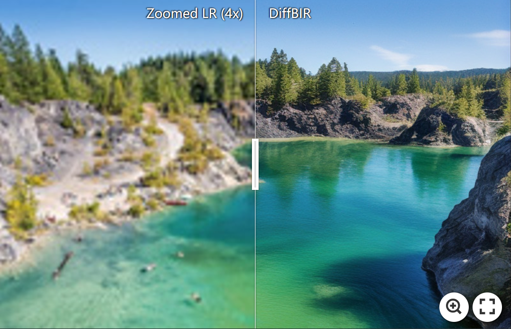](https://imgsli.com/MjAxMjM0) -->

<!-- [](https://imgsli.com/MTk5ODIy) [](https://imgsli.com/MjAxMjM0) -->

### Blind Face Restoration

<!-- [](https://imgsli.com/MTk5ODI5) [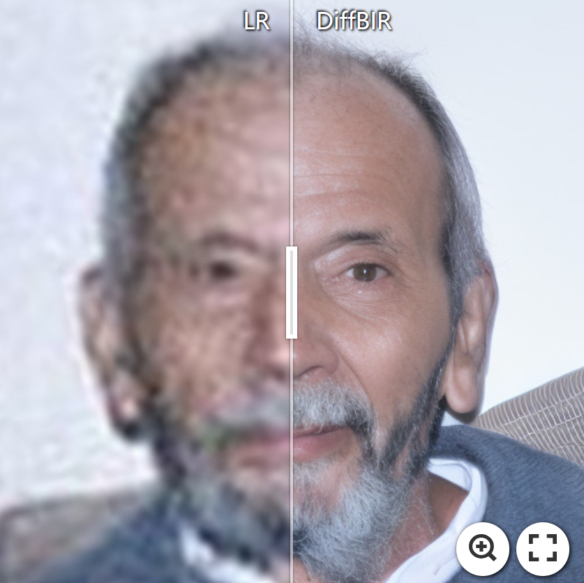](https://imgsli.com/MTk5ODMw) [](https://imgsli.com/MTk5ODM0) -->

[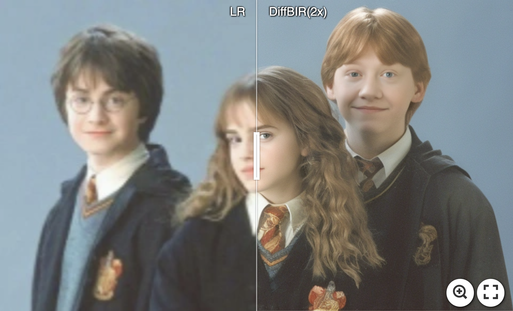](https://imgsli.com/MjA2MTU0) 
[](https://imgsli.com/MjA2MTQ4)

:star: Face and the background enhanced by DiffBIR.

### Blind Image Denoising

[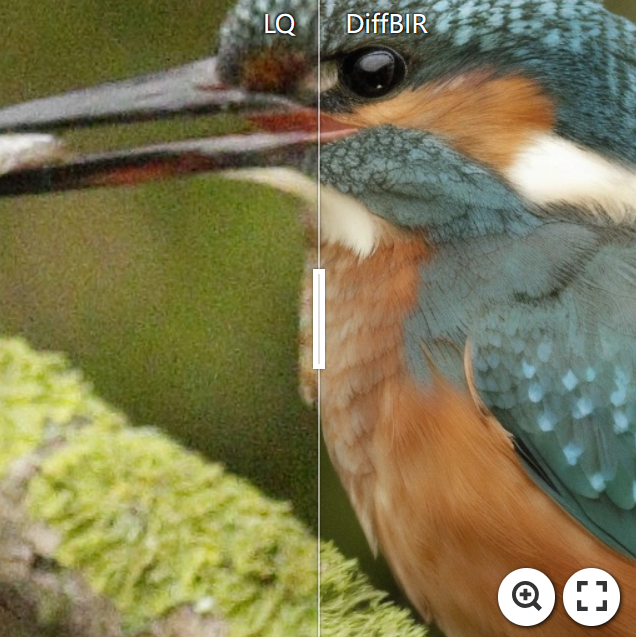](https://imgsli.com/MjUzNzkz) [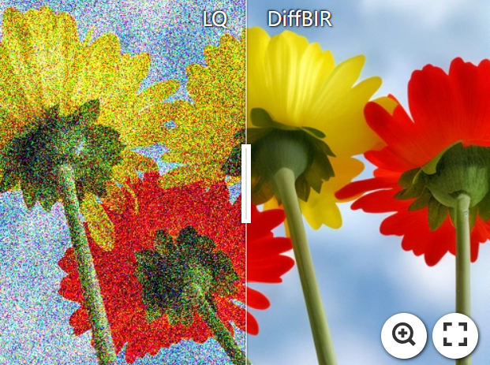](https://imgsli.com/MjUzNzky)
[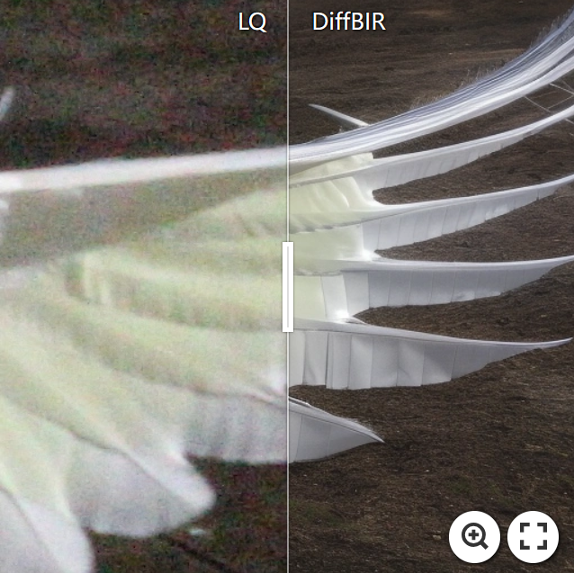](https://imgsli.com/MjUzNzkx)

### 8x Blind Super-Resolution With Patch-based Sampling

> I often think of Bag End. I miss my books and my arm chair, and my garden. See, that's where I belong. That's home. --- Bilbo Baggins

[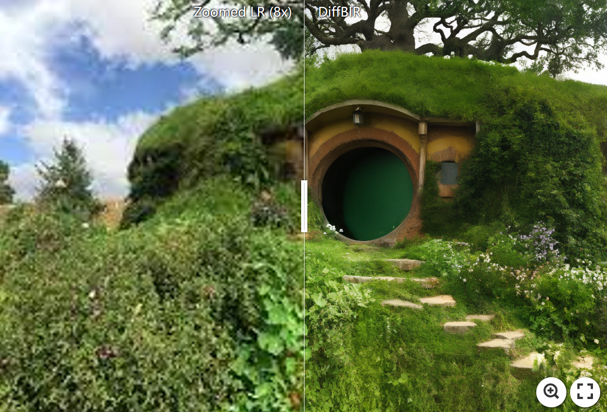](https://imgsli.com/MjUzODE4)

## <a name="todo"></a>:climbing:TODO

- [x] Release code and pretrained models :computer:.
- [x] Update links to paper and project page :link:.
- [x] Release real47 testset :minidisc:.
- [ ] Provide webui.
- [ ] Reduce the vram usage of DiffBIR :fire::fire::fire:.
- [ ] Provide HuggingFace demo :notebook:.
- [x] Add a patch-based sampling schedule :mag:.
- [x] Upload inference code of latent image guidance :page_facing_up:.
- [ ] Improve the performance :superhero:.
- [x] Support MPS acceleration for MacOS users.
- [ ] DiffBIR-turbo :fire::fire::fire:.
- [ ] Speed up inference, such as using fp16/bf16, torch.compile :fire::fire::fire:.

## <a name="installation"></a>:gear:Installation

```shell
# clone this repo
git clone https://github.com/XPixelGroup/DiffBIR.git
cd DiffBIR

# create environment
conda create -n diffbir python=3.10
conda activate diffbir
pip install -r requirements.txt
```

Our new code is based on pytorch 2.2.2 for the built-in support of memory-efficient attention. If you are working on a GPU that is not compatible with the latest pytorch, just downgrade pytorch to 1.13.1+cu116 and install xformers 0.0.16 as an alternative.
<!-- Note the installation is only compatible with **Linux** users. If you are working on different platforms, please check [xOS Installation](assets/docs/installation_xOS.md). -->

## <a name="pretrained_models"></a>:dna:Pretrained Models

Here we list pretrained weight of stage 2 model (IRControlNet) and our trained SwinIR, which was used for degradation removal during the training of stage 2 model.

| Model Name | Description | HuggingFace | BaiduNetdisk | OpenXLab |
| :---------: | :----------: | :----------: | :----------: | :----------: |
| v2.pth | IRControlNet trained on filtered laion2b-en  | [download](https://huggingface.co/lxq007/DiffBIR-v2/resolve/main/v2.pth) | [download](https://pan.baidu.com/s/1uTAFl13xgGAzrnznAApyng?pwd=xiu3)<br>(pwd: xiu3) | [download](https://openxlab.org.cn/models/detail/linxinqi/DiffBIR/tree/main) |
| v1_general.pth | IRControlNet trained on ImageNet-1k | [download](https://huggingface.co/lxq007/DiffBIR-v2/resolve/main/v1_general.pth) | [download](https://pan.baidu.com/s/1PhXHAQSTOUX4Gy3MOc2t2Q?pwd=79n9)<br>(pwd: 79n9) | [download](https://openxlab.org.cn/models/detail/linxinqi/DiffBIR/tree/main) |
| v1_face.pth | IRControlNet trained on FFHQ | [download](https://huggingface.co/lxq007/DiffBIR-v2/resolve/main/v1_face.pth) | [download](https://pan.baidu.com/s/1kvM_SB1VbXjbipLxdzlI3Q?pwd=n7dx)<br>(pwd: n7dx) | [download](https://openxlab.org.cn/models/detail/linxinqi/DiffBIR/tree/main) |
| codeformer_swinir.ckpt | SwinIR trained on ImageNet-1k | [download](https://huggingface.co/lxq007/DiffBIR-v2/resolve/main/codeformer_swinir.ckpt) | [download](https://pan.baidu.com/s/176fARg2ySYtDgX2vQOeRbA?pwd=vfif)<br>(pwd: vfif) | [download](https://openxlab.org.cn/models/detail/linxinqi/DiffBIR/tree/main) |

During inference, we use off-the-shelf models from other papers as the stage 1 model: [BSRNet](https://github.com/cszn/BSRGAN) for BSR, [SwinIR-Face](https://github.com/zsyOAOA/DifFace) used in DifFace for BFR, and [SCUNet-PSNR](https://github.com/cszn/SCUNet) for BID, while the trained IRControlNet remains **unchanged** for all tasks. Please check [code](utils/inference.py) for more details. Thanks for their work!

<!-- ## <a name="quick_start"></a>:flight_departure:Quick Start

Download [general_full_v1.ckpt](https://huggingface.co/lxq007/DiffBIR/resolve/main/general_full_v1.ckpt) and [general_swinir_v1.ckpt](https://huggingface.co/lxq007/DiffBIR/resolve/main/general_swinir_v1.ckpt) to `weights/`, then run the following command to interact with the gradio website.

```shell
python gradio_diffbir.py \
--ckpt weights/general_full_v1.ckpt \
--config configs/model/cldm.yaml \
--reload_swinir \
--swinir_ckpt weights/general_swinir_v1.ckpt \
--device cuda
```

<div align="center">
    <kbd>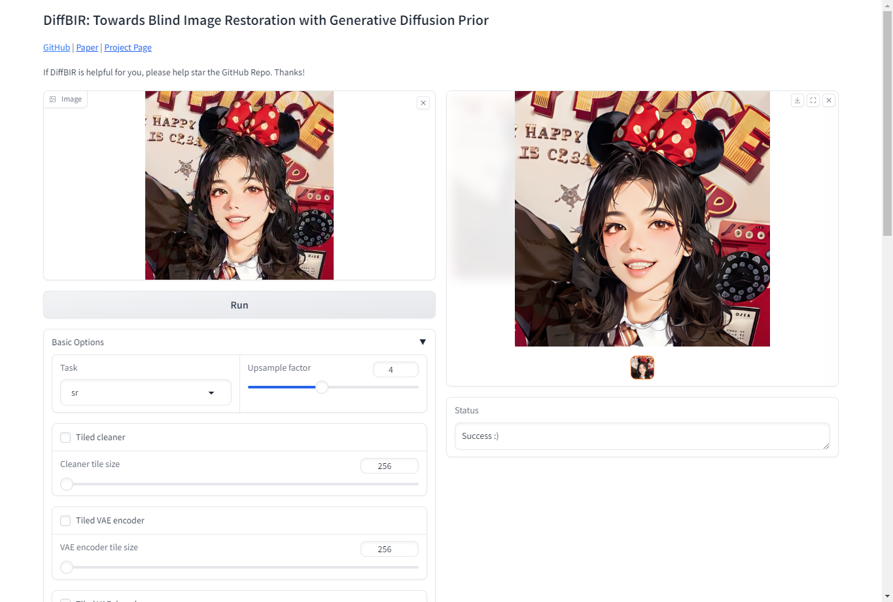</img></kbd>
</div> -->

## <a name="inference"></a>:crossed_swords:Inference

We provide some examples for inference, check [inference.py](inference.py) for more arguments. Pretrained weights will be **automatically downloaded**.

### Blind Image Super-Resolution

```shell
python -u inference.py \
--version v2 \
--task sr \
--upscale 4 \
--cfg_scale 4.0 \
--input inputs/demo/bsr \
--output results/demo_bsr \
--device cuda
```

### Blind Face Restoration
<a name="inference_fr"></a>

```shell
# for aligned face inputs
python -u inference.py \
--version v2 \
--task fr \
--upscale 1 \
--cfg_scale 4.0 \
--input inputs/demo/bfr/aligned \
--output results/demo_bfr_aligned \
--device cuda
```

```shell
# for unaligned face inputs
python -u inference.py \
--version v2 \
--task fr_bg \
--upscale 2 \
--cfg_scale 4.0 \
--input inputs/demo/bfr/whole_img \
--output results/demo_bfr_unaligned \
--device cuda
```

### Blind Image Denoising

```shell
python -u inference.py \
--version v2 \
--task dn \
--upscale 1 \
--cfg_scale 4.0 \
--input inputs/demo/bid \
--output results/demo_bid \
--device cuda
```

### Other options

#### Patch-based sampling
<a name="patch_based_sampling"></a>

Add the following arguments to enable patch-based sampling:

```shell
[command...] --tiled --tile_size 512 --tile_stride 256
```

Patch-based sampling supports super-resolution with a large scale factor. Our patch-based sampling is built upon [mixture-of-diffusers](https://github.com/albarji/mixture-of-diffusers). Thanks for their work!

#### Restoration Guidance

Restoration guidance is used to achieve a trade-off bwtween quality and fidelity. We default to closing it since we prefer quality rather than fidelity. Here is an example:

```shell
python -u inference.py \
--version v2 \
--task sr \
--upscale 4 \
--cfg_scale 4.0 \
--input inputs/demo/bsr \
--guidance --g_loss w_mse --g_scale 0.5 --g_space rgb \
--output results/demo_bsr_wg \
--device cuda
```

You will see that the results become more smooth.

#### Better Start Point For Sampling

Add the following argument to offer better start point for reverse sampling:

```shell
[command...] --better_start
```

This option prevents our model from generating noise in 
image background.

## <a name="train"></a>:stars:Train


### Stage 1

First, we train a SwinIR, which will be used for degradation removal during the training of stage 2.

<a name="gen_file_list"></a>
1. Generate file list of training set and validation set, a file list looks like:

    ```txt
    /path/to/image_1
    /path/to/image_2
    /path/to/image_3
    ...
    ```

    You can write a simple python script or directly use shell command to produce file lists. Here is an example:
    
    ```shell
    # collect all iamge files in img_dir
    find [img_dir] -type f > files.list
    # shuffle collected files
    shuf files.list > files_shuf.list
    # pick train_size files in the front as training set
    head -n [train_size] files_shuf.list > files_shuf_train.list
    # pick remaining files as validation set
    tail -n +[train_size + 1] files_shuf.list > files_shuf_val.list
    ```

2. Fill in the [training configuration file](configs/train/train_stage1.yaml) with appropriate values.

3. Start training!

    ```shell
    accelerate launch train_stage1.py --config configs/train/train_stage1.yaml
    ```

### Stage 2

1. Download pretrained [Stable Diffusion v2.1](https://huggingface.co/stabilityai/stable-diffusion-2-1-base) to provide generative capabilities. :bulb:: If you have ran the [inference script](inference.py), the SD v2.1 checkpoint can be found in [weights](weights).

    ```shell
    wget https://huggingface.co/stabilityai/stable-diffusion-2-1-base/resolve/main/v2-1_512-ema-pruned.ckpt --no-check-certificate
    ```

2. Generate file list as mentioned [above](#gen_file_list). Currently, the training script of stage 2 doesn't support validation set, so you only need to create training file list.

3. Fill in the [training configuration file](configs/train/train_stage2.yaml) with appropriate values.

4. Start training!

    ```shell
    accelerate launch train_stage2.py --config configs/train/train_stage2.yaml
    ```

## Citation

Please cite us if our work is useful for your research.

```
@misc{lin2024diffbir,
      title={DiffBIR: Towards Blind Image Restoration with Generative Diffusion Prior}, 
      author={Xinqi Lin and Jingwen He and Ziyan Chen and Zhaoyang Lyu and Bo Dai and Fanghua Yu and Wanli Ouyang and Yu Qiao and Chao Dong},
      year={2024},
      eprint={2308.15070},
      archivePrefix={arXiv},
      primaryClass={cs.CV}
}
```

## License

This project is released under the [Apache 2.0 license](LICENSE).

## Acknowledgement

This project is based on [ControlNet](https://github.com/lllyasviel/ControlNet) and [BasicSR](https://github.com/XPixelGroup/BasicSR). Thanks for their awesome work.

## Contact

If you have any questions, please feel free to contact with me at linxinqi23@mails.ucas.ac.cn.
